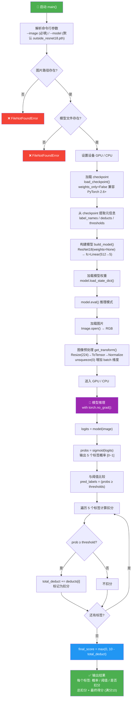

# predict_outside.py 推理流程图

## 阶段说明

| 阶段           | 说明                                                                                |
| -------------- | ----------------------------------------------------------------------------------- |
| **参数校验**   | 检查 `--image` 图片和 `--model` 模型文件是否存在                                    |
| **模型加载**   | 读取 checkpoint → 提取标签名/扣分值/阈值 → 构建 ResNet18 → 加载权重 → `eval()` 模式 |
| **图像预处理** | Resize(224)→ToTensor→ImageNet 归一化（**无数据增强**，与训练不同）                  |
| **推理计算**   | `torch.no_grad()` 下前向传播 → sigmoid 转概率 → 与阈值比较判定是否扣分              |
| **结果输出**   | 逐标签打印概率/阈值/扣分情况 → 汇总总扣分 → 输出最终得分                            |

## 与训练脚本的关键区别

| 对比项       | `train_outside_70.py`                  | `predict_outside.py`    |
| ------------ | -------------------------------------- | ----------------------- |
| **用途**     | 训练模型                               | 单张图片推理            |
| **数据增强** | ✅ RandomCrop/Flip/Rotation/ColorJitter | ❌ 仅 Resize + Normalize |
| **模型模式** | `model.train()`                        | `model.eval()`          |
| **梯度计算** | 需要反向传播                           | `torch.no_grad()` 禁用  |
| **输出**     | loss 值                                | 每个标签概率 + 得分     |

## 5 个分类标签

| 标签    | 名称                            | 扣分 | 阈值 |
| ------- | ------------------------------- | ---- | ---- |
| label_0 | D0_房屋旁柴草堆码乱堆不整齐     | 3    | 0.55 |
| label_1 | D1_房屋周身存在污水横流现象     | 2    | 0.50 |
| label_2 | D2_房屋周身瓜果棚架破败不堪     | 2    | 0.50 |
| label_3 | D3_房屋周身鸡鸭棚圈破败不堪脏臭 | 2    | 0.50 |
| label_4 | D4_房屋周身其他情况             | 1    | 0.65 |

> **评分公式**: 最终得分 = max(0, 10 - 总扣分)
