# train_courtyard_cbam_70.py 训练流程图

```mermaid
flowchart TD
    A["🚀 启动 main()"] --> B["解析命令行参数<br/>--csv, --epochs, --batch_size, --lr, --train_num, --freeze_backbone"]
    B --> C["读取 CSV 文件<br/>read_csv_safely()<br/>尝试 utf-8-sig / gbk / gb18030 / utf-8"]
    C --> D{"CSV 是否包含<br/>house_id, scene, image_path, label_0~11?"}
    D -- 否 --> E["❌ 抛出 ValueError"]
    D -- 是 --> F["筛选 scene == '庭院' 的数据"]
    F --> G{"庭院数据量 > 0?"}
    G -- 否 --> H["❌ 抛出 ValueError"]
    G -- 是 --> I["填充标签空值为 0<br/>验证图片路径是否存在<br/>跳过不存在的图片"]
    I --> J["按 house_id 排序<br/>sort_house_id()"]
    J --> K["划分数据集<br/>前 70 张 → train_df<br/>其余 → holdout_df"]
    K --> L["保存 holdout_df 到<br/>courtyard_cbam_holdout_rows.csv"]
    L --> M["构建 CourtyardDataset + DataLoader<br/>数据增强: Resize→RandomCrop→Flip→Rotation→ColorJitter→Normalize"]
    M --> N["构建模型 ResNet18CBAM<br/>build_model()"]

    N --> N1["加载 ResNet18 预训练权重<br/>conv1→bn1→relu→maxpool→layer1~4"]
    N1 --> N2["在 layer4 后插入 CBAM 模块<br/>ChannelAttention → SpatialAttention"]
    N2 --> N3["avgpool → fc(512→12)"]
    N3 --> N4{"freeze_backbone?"}
    N4 -- 是 --> N5["冻结 ResNet18 主干<br/>只训练 CBAM + fc"]
    N4 -- 否 --> N6["训练全部参数"]

    N5 --> O["模型移至 GPU/CPU"]
    N6 --> O

    O --> P["计算 pos_weight<br/>make_pos_weight()<br/>负样本数 / 正样本数，限制在 [1, 10]"]
    P --> Q["定义损失函数<br/>BCEWithLogitsLoss(pos_weight=...)"]
    Q --> R["定义优化器<br/>AdamW(lr=1e-3, weight_decay=1e-4)"]
    R --> S["初始化 best_train_loss = ∞"]

    S --> T{"Epoch ≤ args.epochs (默认40)?"}
    T -- 是 --> U["model.train()"]
    U --> V["遍历 train_loader 每个 batch"]
    V --> W["images → model → logits<br/>ResNet18 主干 → CBAM → avgpool → fc"]
    W --> X["loss = criterion(logits, targets)"]
    X --> Y["optimizer.zero_grad()<br/>loss.backward()<br/>optimizer.step()"]
    Y --> Z["累加 train_loss"]
    Z --> V
    V --> AA["计算平均 train_loss"]
    AA --> AB{"train_loss < best_train_loss?"}
    AB -- 是 --> AC["更新 best_train_loss<br/>保存 checkpoint 到<br/>models/courtyard_resnet18_cbam.pth"]
    AC --> AD["Epoch + 1"]
    AB -- 否 --> AD
    AD --> T

    T -- 否 --> AE["✅ 训练结束<br/>输出最佳损失 & 模型路径"]

    style A fill:#4CAF50,color:#fff
    style AE fill:#4CAF50,color:#fff
    style E fill:#f44336,color:#fff
    style H fill:#f44336,color:#fff
    style N2 fill:#FF9800,color:#fff
    style AC fill:#2196F3,color:#fff
```

## 阶段说明

| 阶段 | 说明 |
|------|------|
| **数据准备** | 读取 CSV → 筛选"庭院"场景 → 验证图片存在 → 按 house_id 排序 → 前70张训练/其余保留 |
| **模型构建** | ResNet18 预训练主干 + 在 layer4 后插入 **CBAM**（通道注意力 + 空间注意力）→ 冻结主干 → 仅训练 CBAM 和 fc 层 |
| **训练循环** | 每个 epoch 遍历所有 batch → 前向传播 → 计算 BCEWithLogitsLoss（带正样本权重）→ 反向传播 → AdamW 优化 |
| **模型保存** | 仅当 train_loss 下降时保存最佳 checkpoint（含模型权重、标签名、阈值等元信息） |
