# train_outside_70.py 训练流程图

```mermaid
flowchart TD
    A["🚀 启动 main()"] --> B["解析命令行参数<br/>--csv, --epochs(40), --batch_size(8), --lr(1e-3), --train_num(70), --freeze_backbone"]
    B --> C["读取 CSV 文件<br/>read_csv_safely()<br/>尝试 utf-8-sig / gbk / gb18030 / utf-8"]
    C --> D{"CSV 是否包含<br/>house_id, scene, image_path, label_0~4?"}
    D -- 否 --> E["❌ 抛出 ValueError"]
    D -- 是 --> F["筛选 scene == '房前屋后' 的数据"]
    F --> G{"房前屋后数据量 > 0?"}
    G -- 否 --> H["❌ 抛出 ValueError"]
    G -- 是 --> I["填充标签空值为 0<br/>验证图片路径是否存在<br/>跳过不存在的图片"]
    I --> J["按 house_id 排序<br/>sort_house_id()"]
    J --> K["划分数据集<br/>前 70 张 → train_df<br/>其余 → holdout_df"]
    K --> L["保存 holdout_df →<br/>outside_holdout_rows.csv"]
    L --> M["构建 OutsideDataset + DataLoader<br/>数据增强:<br/>Resize(256)→RandomCrop(224)→Flip→Rotation→ColorJitter→ToTensor→Normalize"]
    M --> N["构建模型 build_model()"]

    N --> N1["加载 ResNet18 预训练权重<br/>models.resnet18(weights=DEFAULT)"]
    N1 --> N2{"freeze_backbone?"}
    N2 -- 是 --> N3["冻结全部 backbone 参数<br/>只训练 fc 分类头"]
    N2 -- 否 --> N4["训练全部参数"]
    N3 --> N5["替换 fc 层<br/>nn.Linear(512 → 5)"]
    N4 --> N5

    N5 --> O["模型移至 GPU / CPU"]
    O --> P["计算正样本权重<br/>make_pos_weight()<br/>neg/pos，限制在 [1, 10]"]
    P --> Q["损失函数<br/>BCEWithLogitsLoss(pos_weight=...)"]
    Q --> R["优化器<br/>AdamW(lr=1e-3, weight_decay=1e-4)"]
    R --> S["初始化 best_train_loss = ∞"]

    S --> T{"Epoch ≤ 40?"}
    T -- 是 --> U["model.train()"]
    U --> V["遍历 DataLoader 每个 batch"]
    V --> W["images → ResNet18 → logits (5维输出)"]
    W --> X["loss = criterion(logits, targets)"]
    X --> Y["optimizer.zero_grad()<br/>loss.backward()<br/>optimizer.step()"]
    Y --> Z["累加 batch loss"]
    Z --> V
    V --> AA["计算该 epoch 平均 loss"]
    AA --> AB{"loss < best_train_loss?"}
    AB -- 是 --> AC["更新 best_train_loss<br/>保存 checkpoint →<br/>models/outside_resnet18.pth"]
    AC --> AD["epoch + 1"]
    AB -- 否 --> AD
    AD --> T

    T -- 否 --> AE["✅ 训练结束<br/>输出最佳损失 & 模型路径"]

    style A fill:#4CAF50,color:#fff
    style AE fill:#4CAF50,color:#fff
    style E fill:#f44336,color:#fff
    style H fill:#f44336,color:#fff
    style N3 fill:#FF9800,color:#fff
    style AC fill:#2196F3,color:#fff
```

## 阶段说明

| 阶段         | 说明                                                                                                   |
| ------------ | ------------------------------------------------------------------------------------------------------ |
| **数据准备** | 读取 CSV → 筛选"房前屋后"场景 → 验证图片存在 → 按 house_id 排序 → 前70张训练，其余保留为 holdout       |
| **模型构建** | 加载 ResNet18 预训练权重 → 冻结 backbone → 替换 fc 为 `Linear(512→5)` 输出 5 个标签                    |
| **训练循环** | 每个 epoch 遍历 batch → 前向传播 → BCEWithLogitsLoss（带正样本权重处理不均衡）→ 反向传播 → AdamW 优化  |
| **模型保存** | 仅当 loss 下降时保存最佳 checkpoint 到 `models/outside_resnet18.pth`（含权重、标签名、扣分值、阈值等） |

## 5 个分类标签（房前屋后场景）

| 标签列  | 标签名                          | 扣分 |
| ------- | ------------------------------- | ---- |
| label_0 | D0_房屋旁柴草堆码乱堆不整齐     | 3    |
| label_1 | D1_房屋周身存在污水横流现象     | 2    |
| label_2 | D2_房屋周身瓜果棚架破败不堪     | 2    |
| label_3 | D3_房屋周身鸡鸭棚圈破败不堪脏臭 | 2    |
| label_4 | D4_房屋周身其他情况             | 1    |

> 满分 10 分，根据标签扣分，最低 0 分。
