# ui_folder_score.py 流程图

```mermaid
flowchart TD
    A["🚀 启动 main()"] --> B["创建 Tkinter 窗口<br/>ScoreApp(root)<br/>标题: AI积分制现场照片评分系统"]
    B --> C["显示 GUI 界面<br/>选择文件夹按钮 / 开始评分按钮<br/>结果表格 Treeview / 日志区域"]
    C --> D{"用户操作"}
    
    D -- 点击选择文件夹 --> E["弹出文件夹选择对话框<br/>filedialog.askdirectory()"]
    E --> F["记录 selected_folder<br/>更新界面提示"]
    F --> D

    D -- 点击开始评分 --> G{"已选择文件夹?"}
    G -- 否 --> H["⚠️ 弹出警告: 请先选择文件夹"]
    G -- 是 --> I["启动后台线程<br/>threading.Thread(run_score)"]

    I --> J["run_score() 主流程"]
    
    J --> K["调用 score_folder(folder)"]
    
    K --> K1["🔍 find_label_csv()<br/>在文件夹中查找人工标签 CSV<br/>优先找 同名.csv → 过滤含result/score的 → 取第一个"]
    K1 --> K2["📖 prepare_label_df()<br/>read_csv_safely() 读取 CSV<br/>归一化 scene 列文本"]
    
    K2 --> K3["🔄 遍历 5 个场景<br/>室内 / 庭院 / 厕所 / 化粪池 / 房前屋后"]
    
    K3 --> K4["对每个场景:"]
    K4 --> K5["📋 find_true_row()<br/>在标签 CSV 中匹配场景行<br/>别名匹配 → 模糊匹配"]
    K5 --> K6["🖼️ find_image_in_folder()<br/>在文件夹中找场景图片<br/>文件名含场景别名 → 取排序第一张"]
    K6 --> K7{"找到人工标签行?"}
    K7 -- 是 --> K8["calc_deduct_from_row()<br/>根据标签列计算人工扣分"]
    K7 -- 否 --> K9["true_deduct = NaN"]
    K8 --> K10{"找到场景图片?"}
    K9 --> K10
    K10 -- 是 --> K11["🤖 predict_scene_deduct()"]
    K10 -- 否 --> K12["pred_deduct = NaN"]
    
    K11 --> K11a["load_model_for_scene()<br/>检查缓存 → 加载.pth → build_model → load_state_dict → eval()"]
    K11a --> K11b["图片预处理<br/>Resize(224)→ToTensor→Normalize"]
    K11b --> K11c["with torch.no_grad():<br/>logits → sigmoid → probs"]
    K11c --> K11d["probs ≥ thresholds → pred_labels"]
    K11d --> K11e["累加扣分 → total_deduct"]
    K11e --> K12

    K12 --> K13{"5个场景遍历完?"}
    K13 -- 否 --> K4
    K13 -- 是 --> K14["📊 汇总 4 个项目得分"]

    K14 --> K15["室内: 实际得分/预测得分 (满分10)"]
    K15 --> K16["庭院: 实际得分/预测得分 (满分30)"]
    K16 --> K17["厕所+化粪池: 合并扣分, 实际/预测得分 (满分10)"]
    K17 --> K18["房前屋后: 实际得分/预测得分 (满分10)"]
    K18 --> K19["计算总分 (满分60)<br/>total_true_score / total_pred_score"]
    
    K19 --> K20["💾 保存结果 CSV<br/>ui_score_result_{文件夹名}.csv"]
    K20 --> K21["返回 result_df 到 UI 线程"]

    K21 --> L["更新 Treeview 表格<br/>显示: 项目/满分/实际扣分/预测扣分/实际得分/预测得分/分差"]
    L --> M["更新日志区域<br/>实际总分 / 预测总分 / 总分分差 / 保存路径"]
    M --> N["✅ 评分完成"]

    K1 -- CSV 不存在 --> ERR1["❌ FileNotFoundError"]
    ERR1 --> ERR_END["显示错误弹窗 messagebox.showerror()"]

    style A fill:#4CAF50,color:#fff
    style N fill:#4CAF50,color:#fff
    style H fill:#FF9800,color:#fff
    style K11 fill:#9C27B0,color:#fff
    style K20 fill:#2196F3,color:#fff
    style ERR1 fill:#f44336,color:#fff
    style ERR_END fill:#f44336,color:#fff
```



## 整体架构

```
main() → Tkinter GUI
  └── ScoreApp
        ├── choose_folder()     → 选择农户文件夹
        ├── run_score_thread()  → 启动后台线程
        └── run_score()         → score_folder() → 更新 UI
```

## 5 个场景配置

| 场景     | 模型文件                 | 满分 | 标签数 |
| -------- | ------------------------ | ---- | ------ |
| 室内     | `indoor_resnet18.pth`    | 10   | 10     |
| 庭院     | `courtyard_resnet18.pth` | 30   | 12     |
| 厕所     | `toilet_resnet18.pth`    | —    | 2      |
| 化粪池   | `septic_resnet18.pth`    | —    | 3      |
| 房前屋后 | `outside_resnet18.pth`   | 10   | 5      |

> 厕所 + 化粪池 合并为"厕所及化粪池"一项，满分 10。四项目汇总总分满分 60。

## 核心函数说明

| 函数                     | 作用                                     |
| ------------------------ | ---------------------------------------- |
| `find_label_csv()`       | 在农户文件夹中智能定位人工标签 CSV       |
| `find_true_row()`        | 在 CSV 中通过别名/模糊匹配找到对应场景行 |
| `find_image_in_folder()` | 按文件名中的场景关键词匹配图片           |
| `load_model_for_scene()` | 加载对应场景的 ResNet18 模型（带缓存）   |
| `predict_scene_deduct()` | 模型推理 → sigmoid → 阈值比较 → 计算扣分 |
| `score_folder()`         | 串联全部流程，输出实际 vs 预测对比表     |
| `calc_score()`           | `max(0, 满分 - 扣分)`                    |

## 输入 / 输出

- **输入**: 一个农户文件夹（如 `data/raw/97/`），内含场景图片 + 人工标签 CSV
- **输出**: 
  - GUI 表格展示各项目实际 vs 预测得分
  - 保存 `ui_score_result_{文件夹名}.csv` 到该文件夹
